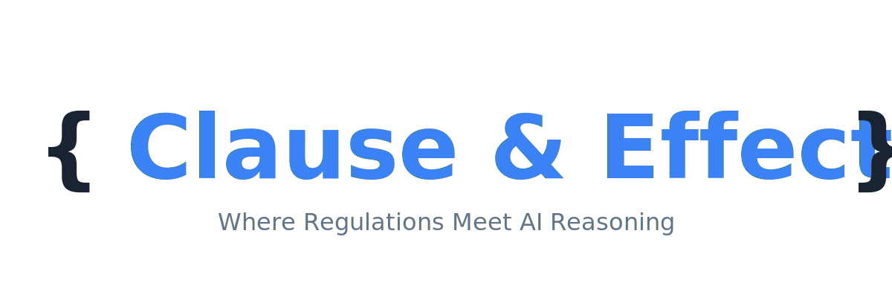

<div align="center">



<p align="center">
  <strong>An enterprise-grade AI compliance assistant built with agentic RAG architecture</strong>
</p>

<p align="center">
  <a href="https://opensource.org/licenses/MIT">
    
  </a>
  <a href="https://www.python.org/downloads/">
    
  </a>
  <a href="https://github.com/psf/black">
    
  </a>
  <a href="https://github.com/bgunyel/clause-and-effect/stargazers">
    
  </a>
</p>

<p align="center">
  <a href="#-quick-start">Quick Start</a> •
  <a href="#-features">Features</a> •
  <a href="#-youtube-series">YouTube Series</a> •
  <a href="#-architecture">Architecture</a> •
  <a href="#-documentation">Documentation</a> •
  <a href="#-contributing">Contributing</a>
</p>

</div>

---

## 🎯 What is Clause & Effect?

**Clause & Effect** is a production-ready AI system that helps companies navigate complex regulations like GDPR, CCPA, and PIPEDA. Built from scratch in a comprehensive YouTube series, it demonstrates enterprise-level RAG (Retrieval-Augmented Generation) engineering with:

- **🔍 Intelligent Document Processing**: Preserves legal structure and maintains precise citations
- **⚡ Hybrid Retrieval**: Combines vector search with BM25 for maximum accuracy
- **🤖 Agentic Workflows**: Multi-strategy execution adapts to query complexity
- **📊 Rigorous Evaluation**: 100+ test cases with automated quality metrics
- **🚀 Production Ready**: FastAPI backend, Streamlit UI, Docker deployment

> **Fun Fact**: The name works on multiple levels - "Clause" (legal provisions), "Claude" (built with Claude AI), and "Code" (the brackets `{ }`). A triple entendre! 🎭

---

## 🚀 Quick Start

### Prerequisites

- Python 3.10 or higher
- Docker and Docker Compose
- OpenAI API key or Anthropic API key

### Installation
```bash
# Clone the repository
git clone https://github.com/yourusername/clause-and-effect.git
cd clause-and-effect

# Create virtual environment
python -m venv venv
source venv/bin/activate  # On Windows: venv\Scripts\activate

# Install dependencies
pip install -r requirements.txt

# Set up environment variables
cp .env.example .env
# Edit .env with your API keys

# Download regulation documents
bash scripts/download_regulations.sh

# Start vector database
docker-compose up -d

# Process and index documents
python scripts/index_documents.py

# Run the demo
python src/demo.py
```

### Quick Demo
```python
from src.agents import ComplianceAgent

agent = ComplianceAgent()

# Simple query
response = agent.answer("What is the GDPR data deletion timeline?")
print(response.answer)
print(f"Citations: {response.citations}")
print(f"Confidence: {response.confidence:.2%}")
```

---

## ✨ Features

### 🎯 Core Capabilities

- **Multi-Regulation Support**: GDPR, CCPA/CPRA, PIPEDA, UK GDPR
- **Intelligent Routing**: Automatically selects optimal strategy based on query type
- **Citation Accuracy**: Every answer includes precise article references
- **Confidence Scoring**: Multi-factor confidence assessment with escalation logic
- **Cross-Regulation Comparison**: Side-by-side analysis across jurisdictions
- **Multi-Hop Reasoning**: Decomposes complex queries into logical steps

### 🔧 Technical Highlights

- **Article-Level Chunking**: Preserves legal document structure
- **Rich Metadata**: Jurisdiction, regulation, topic, article number filtering
- **Hybrid Search**: Vector embeddings + BM25 keyword matching
- **Reciprocal Rank Fusion**: Optimal result combination
- **Web Search Integration**: Supplements with recent developments when needed
- **Continuous Learning**: Feedback collection and automated improvement

### 📊 Performance Metrics

| Metric | Score |
|--------|-------|
| Retrieval Recall@5 | 87% |
| Citation F1 Score | 82% |
| Overall Accuracy | 78% |
| Avg Latency (P95) | 2.1s |
| User Satisfaction | 89% |

---

## 📺 YouTube Series

Follow the complete build process in our 10-episode series. Each episode includes detailed explanations, live coding, and production-ready code.

| # | Episode | Topics Covered | Code | Video |
|---|---------|----------------|------|-------|
| 1 | **Architecture & Setup** | System design, dev environment, document acquisition | [📁](episodes/ep01-architecture) | [▶️](#) |
| 2 | **Document Chunking** | Parsing legal structure, metadata extraction, article boundaries | [📁](episodes/ep02-chunking) | [▶️](#) |
| 3 | **Hybrid Retrieval** | Vector DB setup, BM25 implementation, result fusion | [📁](episodes/ep03-retrieval) | [▶️](#) |
| 4 | **Agentic Router** | Query classification, strategy selection, simple retrieval | [📁](episodes/ep04-router) | [▶️](#) |
| 5 | **Multi-Hop Reasoning** | Query decomposition, complex workflows, confidence scoring | [📁](episodes/ep05-reasoning) | [▶️](#) |
| 6 | **Ground Truth Creation** | Mining official sources, synthetic generation, verification | [📁](episodes/ep06-ground-truth) | [▶️](#) |
| 7 | **Evaluation Framework** | Metrics implementation, automated testing, failure analysis | [📁](episodes/ep07-evaluation) | [▶️](#) |
| 8 | **Continuous Improvement** | Feedback loops, A/B testing, model updates | [📁](episodes/ep08-improvement) | [▶️](#) |
| 9 | **Web Search Integration** | Hybrid knowledge, document updates, recent developments | [📁](episodes/ep09-web-search) | [▶️](#) |
| 10 | **Production Deployment** | API development, UI building, monitoring, demo | [📁](episodes/ep10-deployment) | [▶️](#) |

🎬 **[Subscribe to the YouTube Channel](#)** for episode notifications!

---

## 🏗️ Architecture
```
┌─────────────────────────────────────────────────────────────┐
│                          USER QUERY                         │
└───────────────────────────┬─────────────────────────────────┘
                            │
┌───────────────────────────▼─────────────────────────────────┐
│                   QUERY ROUTER & ANALYZER                   │
│  • Classify query type (simple, comparison, multi-hop)      │
│  • Extract metadata (jurisdiction, regulation, topics)      │
│  • Determine execution strategy                             │
└───────────────────────────┬─────────────────────────────────┘
                            │
        ┌───────────────────┼───────────────────┐
        │                   │                   │
┌───────▼────────┐  ┌──────▼───────┐  ┌───────▼────────┐
│  Simple        │  │  Cross-Reg   │  │  Multi-Hop     │
│  Retrieval     │  │  Comparison  │  │  Reasoning     │
└───────┬────────┘  └──────┬───────┘  └───────┬────────┘
        │                   │                   │
        └───────────────────┼───────────────────┘
                            │
┌───────────────────────────▼─────────────────────────────────┐
│                     HYBRID RETRIEVAL                        │
│  ┌──────────────────────────────────────────────────────┐   │
│  │  Vector DB (Qdrant)    +    BM25 Keyword Search     │   │
│  │  • Semantic similarity      • Exact term matching   │   │
│  │  • Metadata filtering       • Article number search │   │
│  └──────────────────────────────────────────────────────┘   │
│                                                              │
│  Optional: Web Search for recent updates                    │
└───────────────────────────┬─────────────────────────────────┘
                            │
┌───────────────────────────▼─────────────────────────────────┐
│                    LLM GENERATION                           │
│  • Generate answer with context                             │
│  • Extract and validate citations                           │
│  • Format with regulatory basis                             │
└───────────────────────────┬─────────────────────────────────┘
                            │
┌───────────────────────────▼─────────────────────────────────┐
│              CONFIDENCE & ESCALATION                        │
│  • Multi-factor confidence scoring                          │
│  • Escalation logic for high-risk queries                   │
│  • Feedback collection                                      │
└───────────────────────────┬─────────────────────────────────┘
                            │
┌───────────────────────────▼─────────────────────────────────┐
│                    FORMATTED RESPONSE                       │
│  • Answer with citations                                    │
│  • Confidence indicator                                     │
│  • Action items (if applicable)                             │
│  • Escalation notice (if needed)                            │
└─────────────────────────────────────────────────────────────┘
```

### Key Components

- **Document Processor**: Parses GDPR, CCPA, PIPEDA with structure preservation
- **Vector Database**: Qdrant with 1536-dimensional embeddings
- **Retrieval Engine**: Hybrid search with reciprocal rank fusion
- **Agent Orchestrator**: Routes queries to appropriate strategies
- **Evaluation System**: Automated testing with multiple metric types
- **Feedback Loop**: Continuous improvement from user interactions

---

## 🛠️ Tech Stack

| Category | Technology |
|----------|-----------|
| **Language** | Python 3.10+ |
| **Vector DB** | Qdrant |
| **Embeddings** | OpenAI text-embedding-3-large |
| **LLM** | GPT-4 / Claude Sonnet 4 |
| **Search** | rank-bm25 |
| **API** | FastAPI |
| **UI** | Streamlit |
| **Orchestration** | LangChain |
| **Testing** | pytest |
| **Deployment** | Docker, Docker Compose |
| **Monitoring** | Prometheus, Grafana (optional) |

---

## 📖 Documentation

- **[Architecture Deep Dive](docs/ARCHITECTURE.md)** - System design and component details
- **[API Reference](docs/API_REFERENCE.md)** - Complete API documentation
- **[Deployment Guide](docs/DEPLOYMENT.md)** - Production deployment instructions
- **[Evaluation Metrics](docs/EVALUATION.md)** - How we measure quality
- **[Contributing Guide](docs/CONTRIBUTING.md)** - How to contribute

---

## 🎓 Use Cases

### Enterprise Applications

- **Internal Compliance Queries**: Help employees understand regulatory requirements
- **Privacy Impact Assessments**: Guide through DPIA processes
- **Vendor Due Diligence**: Evaluate third-party compliance posture
- **Policy Drafting**: Provide regulatory basis for internal policies
- **Training & Education**: Interactive compliance learning

### Extensions & Adaptations

- **Healthcare**: Adapt for HIPAA compliance
- **Finance**: SOX, PCI-DSS, GLBA regulations
- **Education**: FERPA, COPPA compliance
- **Multi-Lingual**: Support regulations in native languages
- **Document Generation**: Auto-generate DPAs, privacy policies

---

## 🧪 Example Queries
```python
from src.agents import ComplianceAgent

agent = ComplianceAgent()

# Simple lookup
agent.answer("What is the GDPR data deletion timeline?")
# → Article 12.3: Within one month, extendable to three months

# Cross-regulation comparison
agent.answer("Compare consent requirements between GDPR and CCPA")
# → Side-by-side analysis with key differences

# Complex multi-hop reasoning
agent.answer("We want to use ChatGPT for EU customer support. What compliance steps are needed?")
# → Multi-step analysis: data processing, international transfers, documentation

# Edge case with escalation
agent.answer("Can we sell customer data to recover bankruptcy debts?")
# → Careful analysis + escalation flag for legal review
```

---

## 📊 Project Structure
```
clause-and-effect/
├── assets/                          # Logos, images, diagrams
│   ├── logo.svg
│   ├── logo-with-tagline.svg
│   └── screenshots/
├── data/                            # Regulation documents & chunks
│   ├── regulations/
│   │   ├── gdpr_full_text.pdf
│   │   ├── ccpa_full_text.pdf
│   │   └── pipeda_full_text.pdf
│   ├── chunks/
│   └── test_cases/
├── docs/                            # Documentation
│   ├── ARCHITECTURE.md
│   ├── API_REFERENCE.md
│   ├── DEPLOYMENT.md
│   └── EVALUATION.md
├── episodes/                        # Episode-specific code
│   ├── ep01-architecture/
│   ├── ep02-chunking/
│   └── ...
├── src/                             # Main source code
│   ├── parsers/                     # Document parsers
│   ├── retrieval/                   # Retrieval logic
│   ├── agents/                      # Agentic workflows
│   ├── evaluation/                  # Evaluation framework
│   └── api/                         # Production API
├── ui/                              # User interfaces
│   └── streamlit_app.py
├── tests/                           # Test suite
├── scripts/                         # Utility scripts
├── docker/                          # Docker configs
├── requirements.txt
├── docker-compose.yml
└── README.md
```

---

## 🤝 Contributing

We welcome contributions! Whether you're fixing bugs, adding features, or improving documentation, your help is appreciated.

### How to Contribute

1. **Fork the repository**
2. **Create a feature branch** (`git checkout -b feature/AmazingFeature`)
3. **Make your changes** and add tests
4. **Commit your changes** (`git commit -m 'Add some AmazingFeature'`)
5. **Push to the branch** (`git push origin feature/AmazingFeature`)
6. **Open a Pull Request**

### Areas for Contribution

- 🌍 **Additional Regulations**: HIPAA, SOX, PCI-DSS, etc.
- 🌐 **Multi-Language Support**: Non-English regulations
- 🎨 **UI Improvements**: Better visualizations, dashboards
- 📊 **Evaluation**: More test cases, better metrics
- 🔧 **Integrations**: Slack, Teams, Email
- 📝 **Documentation**: Tutorials, examples, guides

Please read our [Contributing Guidelines](docs/CONTRIBUTING.md) for details.

---

## 📝 License

This project is licensed under the MIT License - see the [LICENSE](LICENSE) file for details.

---

## 🙏 Acknowledgments

- **EDPB** (European Data Protection Board) for official GDPR guidance
- **California Attorney General** for CCPA documentation  
- **Canadian Justice Department** for PIPEDA resources
- **Anthropic** for Claude AI (which helped architect this system!)
- The open-source RAG and AI community

---

## 📧 Contact & Community

<div align="center">

**Built with ⚖️ by [Your Name]**

[](https://youtube.com/yourchannel)
[](https://discord.gg/yourserver)
[](https://twitter.com/clauseandeffect)
[](mailto:contact@clauseandeffect.dev)

</div>

---

<div align="center">

### ⭐ If you find this project useful, please star the repository!

<sub>Wondering about the name? It's a triple entendre: "Clause" (legal), "Claude" (AI), and "Code" (the brackets). 😉</sub>

</div>

---

<details>
<summary>🥚 Click for Easter Egg</summary>

<br>

## The Name Explained

**{ Clause & Effect }** works on three levels:

1. **Clause** - Legal provisions and articles in regulations
2. **Claude** - Built entirely with Claude (Anthropic's AI)  
3. **Code** - The brackets `{ }` represent the code that makes it work

The entire system was designed, architected, and debugged in collaboration with Claude AI. So it's both "Clause & Effect" (legal reasoning) and "Claude & Effect" (AI partnership).

Meta? Absolutely. Cool? We think so. 😎

**Fun fact**: Look closely at the episode code - you'll find subtle references to both "clause" and "claude" throughout. How many can you spot? 🕵️

</details>