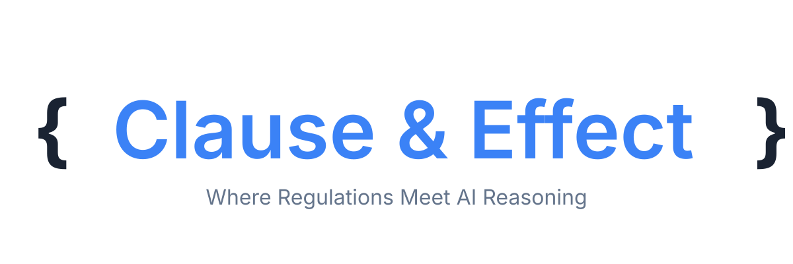

  <strong>Where regulations meet AI reasoning — built in public, evaluation-first.</strong>

  
  
  

  <a href="#-what-is-clause--effect">About</a> •
  <a href="#-status">Status</a> •
  <a href="#-why-evaluation-first">Why Evaluation-First</a> •
  <a href="#-follow-the-build">Follow the Build</a> •
  <a href="#-license">License</a>

---

## 🎯 What is Clause & Effect?

**Clause & Effect** is a question-answering system over regulatory text. GDPR is the first corpus; the plan is to extend to the GDPR-like privacy laws of other countries and US states.

The project has one governing rule: **every architecture decision gets measured before it gets kept.** The evaluation framework comes first — before clever retrieval, before agentic anything. Architectures are temporary; the eval is the durable asset.

---

## 📊 Status

Early and honest — this is a work in progress, being built live.

- ✅ **Baseline RAG** over GDPR articles
- 🔨 **Tier-1 evaluation set** — factual Q&A grounded directly in GDPR text (in progress)
- 📋 **Tier-2** — multi-hop reasoning across articles (planned)
- 📋 **Tier-3** — vague, realistic user queries (planned)
- 📋 **Baseline numbers published** — including exactly what the system gets wrong (next milestone)

> No performance claims will appear in this README before the numbers that back them.

---

## 🧭 Why Evaluation-First?

1. **🔢 You can't improve what you can't measure.** Every change — chunking, retrieval strategy, agentic vs. vanilla RAG — is a claim that something got better. Without an eval, "better" is a feeling.

2. **🪜 Real questions come in tiers.** Most RAG systems are only ever tested on factual lookups (Tier 1). Users ask Tier 3. The gap between them is where systems quietly fail.

3. **🏗️ Evals outlive architectures.** When the next model release makes the pipeline look outdated, the eval decides — with numbers, not vibes — whether to rip it out. The same eval method is what will carry this project to new jurisdictions. That transfer will be measured, not claimed.

---

## 📺 Follow the Build

Built live on stream, with a written devlog after every session.

---

## 📝 License

This project is licensed under the MIT License — see the [LICENSE](LICENSE) file for details.

---

**Built with ⚖️ by Bertan Günyel**

### ⭐ If you find this project useful, please star the repository!

